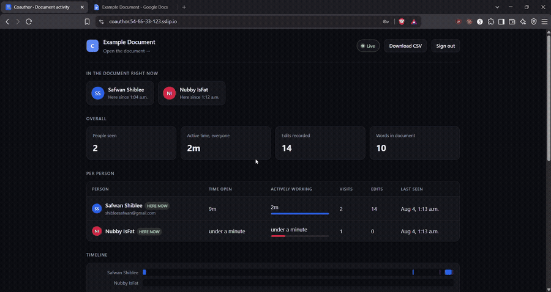
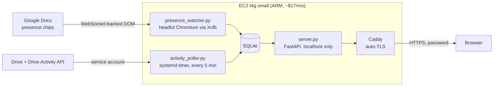

# Coauthor

[](https://www.python.org/)
[](https://fastapi.tiangolo.com/)
[](https://playwright.dev/)
[](https://www.sqlite.org/)
[](https://www.terraform.io/)
[](https://aws.amazon.com/)
[](https://caddyserver.com/)


[](LICENSE)

**Who actually worked on the group document, and when.**

Google Docs shows you *that* a document changed. It does not readily tell you who
was present, for how long, or how the work was distributed — which is exactly the
question that matters when a group project's contribution is disputed.

Coauthor answers it from two independent sources, stores them in SQLite, and
serves a dashboard that is careful never to claim more than it actually knows.

<!-- Replace with your recording -->


---

## What it does

| Signal | Source | What it proves |
|---|---|---|
| **Edit history** | Drive API revisions + Drive Activity API | Who changed the document and when. Server-side, retroactive, survives everything. |
| **Presence** | A real Chrome session parked in the document | Who had it open, and when they arrived and left. Live only. |
| **Activity** | Collaborator cursor movement | Rough engagement while present. A floor, not a total. |

The two paths are deliberately independent. Presence depends on a browser session
that Google can invalidate at any time; edit history depends only on an API
credential. When the fragile half breaks, the durable half keeps recording, and
the dashboard says which one is degraded rather than quietly showing less.

## Architecture



Presence has no API. Google exposes collaborator state only to a browser sitting
in the document, so the watcher is a real signed-in Chromium driven by
Playwright, running headful under Xvfb because Google treats headless sessions
with suspicion. That is the fragile part of the system, and most of the
reliability work below exists because of it.

---

## Reliability engineering

Each item below is a failure this system hit in production and now handles.

### Liveness must be a signal, not an inference

Presence rows are only written when something *changes*. An empty document
produces silence, which is indistinguishable from a dead watcher. Judging health
by "time since last event" reported a perfectly healthy watcher as offline the
moment everyone left.

The watcher now emits a **heartbeat every 30s** into a single `meta` row —
regardless of what the document is doing. Health is judged on that. It lives in
`meta` rather than the events table so it updates one row instead of adding
~2,900 a day and burying the real events.

### Distinguish "not running" from "running but blind"

Three failure modes look identical from the outside — the watcher is up and
reports nothing:

| Failure | Detection | Response |
|---|---|---|
| Signed out by Google | redirected to `accounts.google.com` | exit 2, record reason, **stop retrying** |
| No access to the document | editor never renders, page says "You need access" | exit 3, record reason, **stop retrying** |
| Connection dropped | Docs shows a reconnect banner | reload the page after 75s |

The first two need a human. The third is self-healing. Telling them apart is the
difference between a fix and a restart loop.

### Restart policies encode assumptions

`Restart=always` relaunched a signed-out watcher **696 times in a row**, once
every 30 seconds, each spawning a full Chromium — burning CPU and burying the one
line that mattered under hundreds of identical failures.

```ini
RestartPreventExitStatus=2 3   # signed out / no access: only a person can fix these
```

Restarting is only correct when the failure is transient. Encoding *which*
failures are transient is a design decision, not a default.

### Degrade, don't fail

Presence is read from the collaborator chips in the header. If Google renames
those CSS classes, the watcher falls back to detecting live cursors instead, with
a wider debounce, and marks the data degraded. Slower and noisier — but still
recording, rather than blind until someone notices.

### Never claim more than you know

A disconnected page keeps rendering whoever was on screen when the connection
dropped. The collaborator list freezes, so someone who left hours ago stays
listed as present forever. A dropped connection is now treated as a **gap in
coverage**: sessions end at the disconnect, and the dashboard says so.

The same principle throughout — the dashboard shows *"Live tracking has stopped:
the tracking account has been signed out by Google"*, not a silently empty panel.
Stale data that looks live is worse than an honest gap.

### Measure to a known-good clock

A session that is still open has no end time. Measuring it to "the last recorded
event" freezes the number the moment the document goes quiet. Measuring it to
"now" credits time the watcher may not have been watching. Open sessions are
measured to **the last heartbeat** — so they tick upward while the watcher is
alive and stop dead when it isn't.

### Migrations run on every start and must be idempotent

There is no migration tool and no maintenance window; the schema is repaired at
connection time. That means every migration has to survive running twice, and be
ordered so it cannot trip the constraint it is restoring.

---

## Incidents

Real bugs, how they were found, and what the evidence was.

<details>
<summary><b>Silent data corruption: NULL defeated a UNIQUE constraint</b></summary>

`INSERT OR IGNORE` deduplicated edit events against
`UNIQUE(ts, person, kind, revision_id)`. Drive Activity rows carry no revision
id, so that column was `NULL` — and **SQL treats every NULL as distinct from
every other NULL**, so the constraint silently never applied.

The poller deliberately re-reads a 10-minute overlapping window every 5 minutes,
so every activity event would be stored two or three times.

```
inserted 5x  ->  revision       1 row   (deduped)
inserted 5x  ->  activity:EDIT  5 rows  (NOT deduped)
```

Nothing failed. No error was logged. The edit count — the number the whole tool
exists to produce — would simply have inflated over time.

**Fix:** empty string instead of `NULL`, plus an idempotent migration. The first
attempt at that migration was itself wrong: rewriting NULLs to `''` tripped the
very constraint being restored. It has to dedupe *first*, then rewrite.
</details>

<details>
<summary><b>Presence frozen by a disconnected page</b></summary>

Someone closed the document and stayed listed as present indefinitely.

```
22:39:36  join Alice Chen  (chip)
22:40:42  disconnected
22:41:45  disconnected      <- every 63s, nothing else, ever
```

Zero cursor events for 17 minutes and no departure either — a healthy page would
have produced one or the other. The connection had dropped, so the DOM was frozen
with the collaborator list painted as it was at that instant.

**Fix:** two halves. The watcher reloads after 75s of sustained disconnection
instead of waiting up to 30 minutes for the next scheduled reload; and the report
treats a disconnect as a coverage gap, so sessions end there rather than running
forever.
</details>

<details>
<summary><b>A departure that reopened itself</b></summary>

Departures are backdated to the last moment the person was actually seen, so
session lengths stay honest. But a cursor event recorded **one millisecond
later** sorted *after* the departure — and the sessioniser treated any cursor
event as evidence of presence:

```
19:39:29.626Z  Marcus Bell  leave   chip
19:39:29.627Z  Marcus Bell  cursor  cursor   <- reopened the closed session
```

**Fix:** cursor movement measures activity and must never *start* a session.
Arrivals come from arrival events, which the page script emits in both normal and
degraded modes.
</details>

<details>
<summary><b>The infrastructure was one apply away from deleting itself</b></summary>

`user_data_replace_on_change = true` meant editing the bootstrap script — even a
comment — forced Terraform to **destroy and recreate the instance**, taking the
database, the signed-in browser profile and the TLS certificate with it.

```
Plan: 2 to add, 0 to change, 2 to destroy.
```

`user_data` only ever executes on first boot, so changing it has no effect on a
running instance. Terraform's model and reality disagreed, and the default was
the destructive one.

**Fix:** `ignore_changes = [ami, user_data]`. A rebuilt instance still gets the
current script, because this only suppresses the diff on an existing one.
</details>

<details>
<summary><b>One person, three names</b></summary>

The same human arrives under three unrelated identifiers: Drive revisions report
the account handle, the presence chip reports the display name, and Drive
Activity reports only a numeric actor id. Nothing in any feed links them, so one
person's contribution splits across three rows.

`resolve_people.py` correlates actor ids against revision timestamps and only
accepts a name that wins by a clear margin, leaving the rest explicitly
unresolved rather than guessing. The resulting chain collapses on read:

```
people/1234...  ->  achen  ->  Alice Chen
```

Applied at read time, so fixing a name takes effect on the next refresh with no
restart and no data migration.
</details>

<details>
<summary><b>"1h 60m"</b></summary>

Minutes were rounded independently of hours, so 1:59:59 rendered as `1h 60m`.
**1,650 distinct inputs** produced an impossible value. Trivial, and it was on
screen the whole time — a reminder that the formatter is as much a part of
correctness as the query.
</details>

---

## Infrastructure

Terraform, one `apply` from nothing:

- **No SSH.** No key pair, no port 22, no bastion. Shell access and the VNC
  tunnel for the one-time Google sign-in both go through **AWS Systems Manager
  Session Manager**, so the only inbound ports are 80 and 443.
- **Least privilege.** The instance role can read its deployment bucket and
  delete exactly one object (the credentials bundle, after unpacking). Nothing
  else.
- **IMDSv2 required**, hop limit 1 — the standard SSRF-to-credential-theft path
  is closed.
- **Encrypted gp3 root volume.**
- **Auto-TLS** via Caddy and Let's Encrypt, using `sslip.io` so no domain is
  needed.
- **Password-protected dashboard**: HMAC-signed session cookies, constant-time
  comparison, rate limiting that prunes itself rather than growing unbounded
  under scanning.
- **Cost is an output**, not a surprise — `terraform output estimated_monthly_cost`
  breaks down compute, storage and IPv4 with the assumptions stated.

Deployment is a single PowerShell script: package, upload to S3, run via SSM,
poll for completion. Credentials travel separately from code and are shredded
after unpacking.

---

## Running it

```bash
pip install -r requirements.txt
playwright install chromium

cp config.example.json config.json     # set doc_id
python presence_watcher.py --login     # sign in once, as the tracking account
```

Then, in three terminals:

```bash
python presence_watcher.py             # presence
python activity_poller.py              # edit history (or --once)
COAUTHOR_PASSWORD=... COAUTHOR_SECRET=... uvicorn server:app --port 8000
```

For the EC2 deployment, see **[DEPLOY.md](DEPLOY.md)**.

The tracking account needs read access to the document, and nothing more.

---

## What this deliberately does not claim

Honest limitations, because a tool used to settle an argument has to be
defensible:

- **"Actively working" is a floor, not a total.** It credits about half a minute
  per burst of cursor movement. Scrolling and reading move no cursor, so a
  careful reader can show very little.
- **Google disconnects idle sessions** after roughly 15–20 minutes, which ends a
  presence session even though the tab is still open. Long reading sessions
  under-count.
- **Presence starts when the watcher does.** It cannot see the past. Edit
  history can, going back as far as the document's revisions.
- **A closed tab and a dropped connection are indistinguishable** from the DOM,
  so departures are labelled as leaving, not as "closed the document".
- **Automated browser sessions get invalidated.** A tracking account driven from
  a datacenter IP should be expected to need periodic re-authentication. The
  dashboard says when this has happened rather than showing stale presence.

## Scope, and a note on terms

The two halves sit differently with Google, and it is worth being straight about
that rather than leaving it implied.

**Edit history uses official, documented APIs** — Drive and Drive Activity, with
read-only scopes, through a normal OAuth client or service account. Entirely
sanctioned, and it is the stronger evidence of the two.

**Presence has no API.** Google exposes collaborator state only to a browser
connected to the document, so the watcher automates a real signed-in Chromium.
That sits awkwardly against the clause in Google's Terms of Service about
accessing services "using the interface and instructions we provide". Enforcement
in practice is account-level rather than legal — sign-in challenges, invalidated
sessions, and in one case during development an account flagged outright.

Practical reading: use a dedicated tracking account you would not mind losing,
expect to re-authenticate it periodically, and do not point this at documents you
have no legitimate access to. The dashboard degrades honestly when the presence
half is blocked, precisely because that half is expected to break.

## Privacy

This records named people and timestamps. Everyone in the document can see the
tracking account in the collaborator list — it is not covert, and it should not
be. Tell the group it is running.

## Licence

MIT
